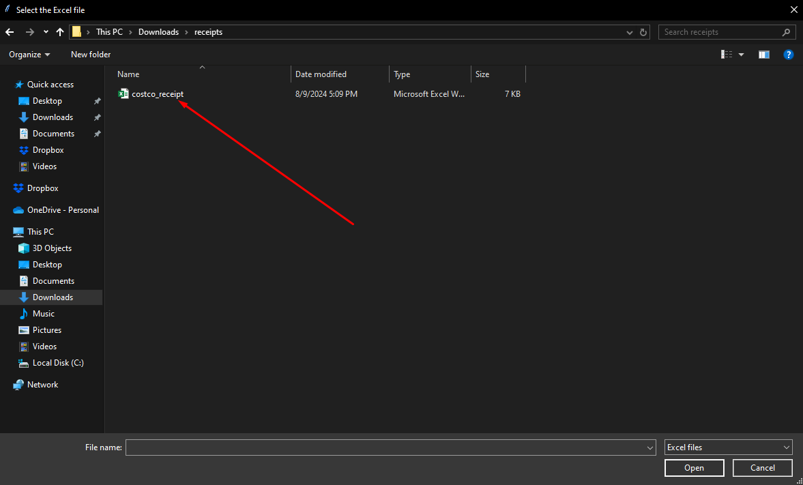
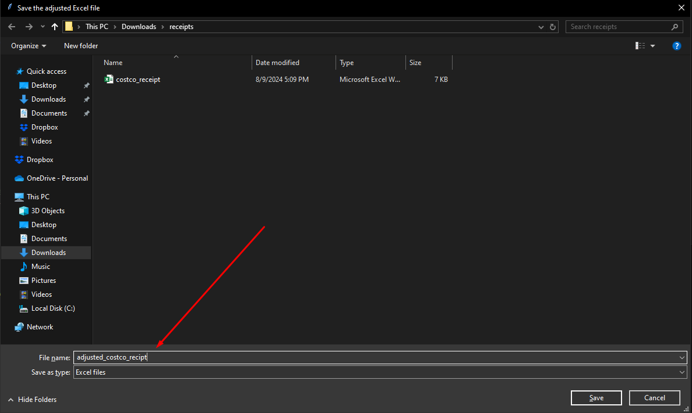
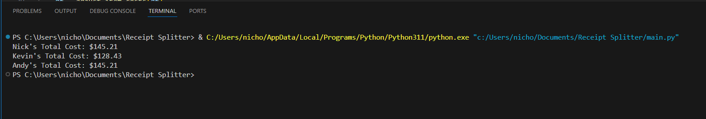

# Costco Receipt Splitter

This project helps in splitting costs among customers based on who shares each item from a Costco receipt.

## Project Structure

- **`main.py`**: The entry point of the project. It handles loading the data, adjusting costs, calculating totals, and saving the results.
- **`utils.py`**: Contains utility functions for adjusting costs, calculating totals, and saving data to Excel.

## How to Run

1. **Install Dependencies**

   Make sure you have `pandas` installed. If not, you can install it using pip:
   ```bash
   pip install pandas
   
2. **Run Program**
   
   `python main.py`
   
3. **Select an Excel File**
   
   Navigate through the file explorer and select an excel file with itemized items per customer.
   
   
   
4. **Save Adjusted File**
   
   The program will manipulate the original file and save a copy, so be sure to name the new adjusted file so that the original isn't overwritten.
   
   
   
5. **Review Output**
    
   The program will then separate the receipt per listed customer, but be sure to always review it for accuracy.
   
   
